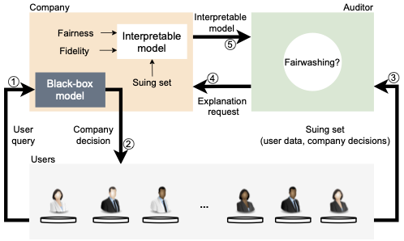

# FRAUD-Detect:

This is the official repository of [Washing The Unwashable : On The (Im)possibility of Fairwashing Detection](https://nips.cc/Conferences/2022/Schedule?showEvent=54741), a work published in the Thirty-Sixth Conference on Neural Information Processing Systems (NeurIPS), New Orleans, Louisiana, USA, November 28 - December 9, 2022.<br>



## Setup:
1. Clone code:

    ```bash
    git clone https://github.com/cleverhans-lab/FRAUD-Detect.git 
    ```

2. Create virtual environment (use Python 3.8):

    ```bash
    python3 -m venv FRAUDDetect_env 
    source /FRAUDDetect_env/bin/activate
    pip3 install -r requirements.txt
    ```
    
## Description
The code contains: 
1. Training black-box models
2. Fairwashing, training interpretable models
3. Deteting fairwashing using FRAUD-Detect
4. Evading FRAUD-Detect using an informed adversary


### Training black-box models
The folder `./FRAUD-Detect_code/models/` contains several files to train
black-box models (AdaBoost, DNN, RF, and XgBoost) from scratch, **their
architectures and all hyper-parameters** are located in the `train_models.py` 
script, though `main.sh` will train the models for all seed and generate 
labels for both the suing and test set which are identical to those used
in our paper.

Note: training the black-box models requires tensorflow.

### Fairwashing, training interpretable models
The code currently supports:

- 3 datasets (Adult income, COMPAS, and Bank Marketing)
- 4 black-box models (DNN, AdaBoost, XgBoost, and Random Forest)
- 2 interpretable models (Descision Trees, Logistic Regression)

To run this code, see the section below:

### Detecting fairwashing using FRAUD-Detect
To observe the KL_confusion_matrix vs Demographic Parity
graph for 10 seeds of a given dataset, interpretable model,
and black-box model combination:

```bash
cd FRAUD-Detect_code/washing_analysis
python analysis.py --help
```

Rerun the last line with requested arguments (note, epsilons are 
optional and given as space separated floats).
Results will be generated in ``./sample_results/`` 
directory. 

There are two graphs available 
here, the C_KL over Demographic Parity for each seed with dashed lines 
showing the black-box fairness, and also plots showing demographic 
parity and C_KL over 1-$\epsilon$ with seaborn-style error shadings. 

### Evading FRAUD-Detect using an informed adversary
The folder `./FRAUD-Detect_code/threshold_plotting/threshold_plots.py`
creates plots showing the range of unfairnesses achievable by a
user seeking to evade the fairwashing detector. 

## References
If you use our code, please cite the following paper:

      @InProceedings{shamsabadi2022FraudDetect,
        title = {Washing The Unwashable : On The (Im)possibility of Fairwashing Detection},
        author = {Shahin Shamsabadi, Ali and Yaghini, Mohammad and Dullerud, Natalie and Wyllie, Sierra and Aïvodji, Ulrich and Alaagib, Aisha and Gambs, Sébastien and Papernot, Nicolas},
        booktitle = {The Thirty-Sixth Conference on Neural Information Processing Systems (NeurIPS)},
        year = {2022},
        address = {New Orleans, Louisiana, USA},
        month = November 28-December 9
      }

Citations: 

https://github.com/aivodji/LaundryML (GNU General Public License v3.0)


